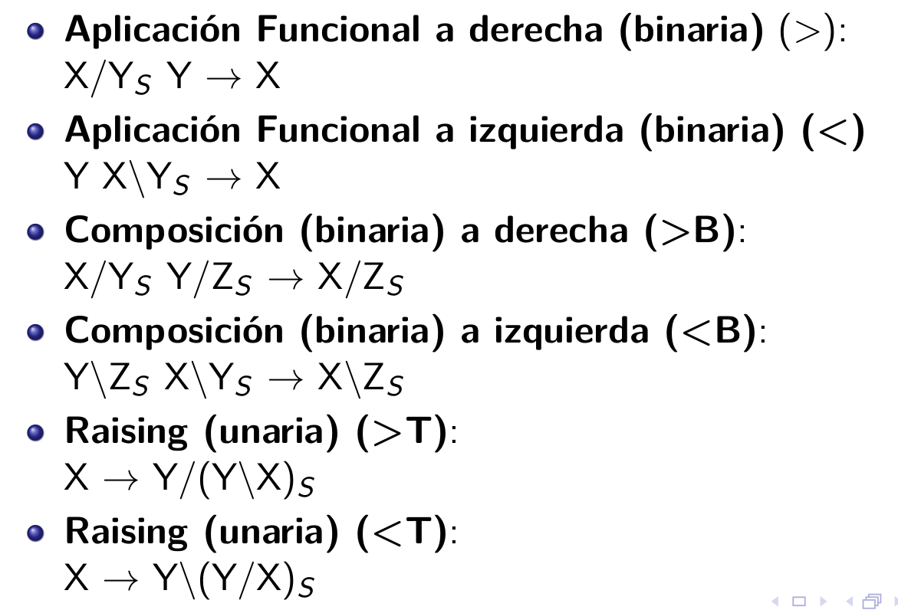

# Gramáticas categoriales


```python
import nltk 
import re 
import os, sys
import matplotlib 
```

Las gramáticas categoriales están conformadas principalmente por un conjunto reducido de reglas y un léxico sumamente rico.
Las reglas que utiliza OpenCCG, que es el parser categorial que vamos a ver son las siguientes:



Construir una gramática categorial consiste principalmente en elaborar un léxico lo suficientemente rico, ya que las gramáticas categoriales son fuertemente lexicalistas. En ellas, la categoría a la que pertenece cada entrada léxica codifica sus posibilidades combinatorias.

## Combinatory Categorial Grammar


```python
#Combinatory Categorial Grammar

from nltk.ccg import chart, lexicon

def combinatory_parser(sentence):   
    sentence = sentence.lower()                                     # convierte a minúscula
    if sentence.endswith('.'):                                      # si la oración termina con un punto
        sent = re.sub('\.',' ',sentence)                            # se lo quita
    else:                                                           # si no
        sent = sentence                                             # la toma como está
    sent = sent.split()                                             # divide la oración en palabras
    archivo = open('gramaticas/CategorialGrammar2.txt', 'r')
    codigogram = archivo.read()
    lex = lexicon.fromstring(codigogram)
    print(lex)
    parser = chart.CCGChartParser(lex, chart.DefaultRuleSet)
    archivo.close()
    for parse in parser.parse(sent):  # doctest: +SKIP
         chart.printCCGDerivation(parse)
         #break       

```


```python
print('Escribí una oración')
oracion5 = input()
combinatory_parser(oracion5)
```


```python

```
